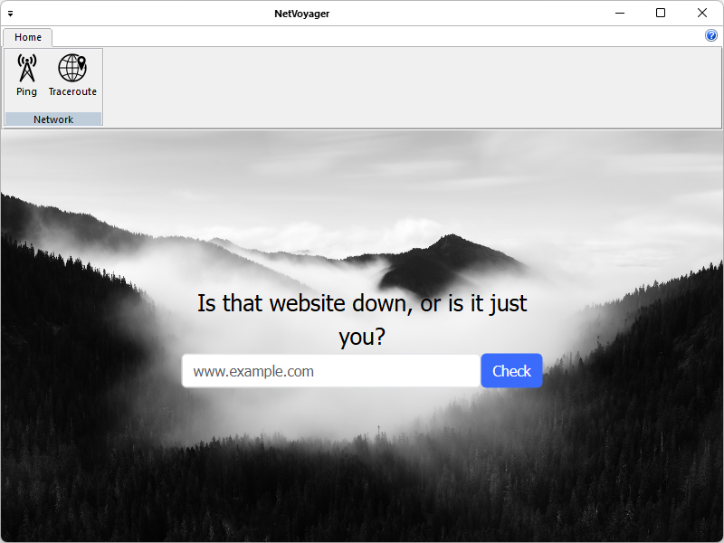
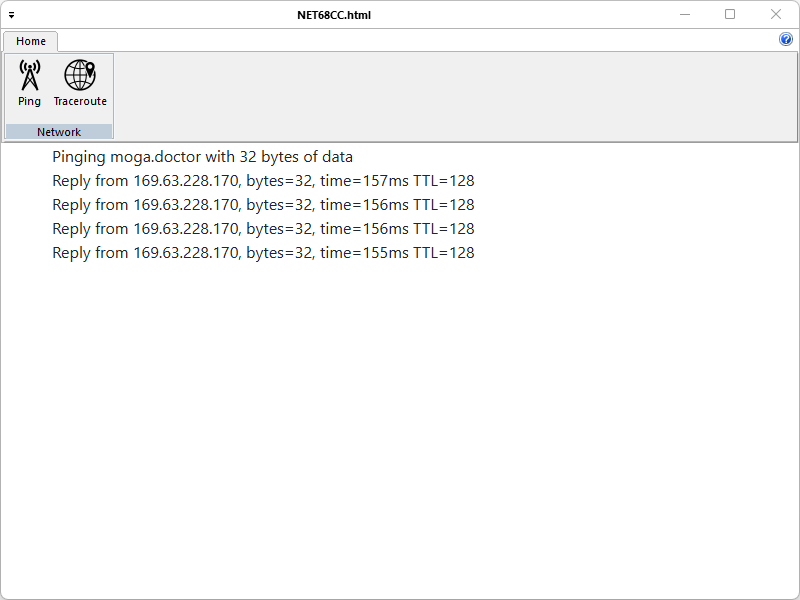
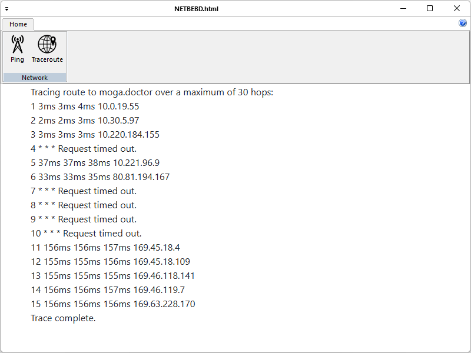

# NetVoyager
NetVoyager is a lightweight network diagnostics app that lets users quickly assess connectivity and trace routes. With built-in ping and traceroute tools, it helps identify latency issues, unreachable hosts, and visualize packet paths. Ideal for IT pros, engineers, and curious users, with a clean UI and real-time results.

## ✨ Features
- **Ping** with live latency, packet loss, and summary stats.
- **Traceroute** to visualize the path to any host and identify slow or unreachable hops.
- **Clean MFC-based UI** optimized for quick diagnostics on Windows.
- **Portable build** — a single `NetVoyager.exe` you can copy and run on target machines.

## 🛠️ Build (MSBuild / Visual Studio)

### Requirements
- **Windows 10/11** or **Windows Server 2019/2022**
- **Visual Studio 2026** with **Desktop development with C++**
- **Windows SDK 10.0.x** or newer
- **C++17** or later toolset

### Steps
1. Clone the repository
```bash
git clone https://github.com/mihaimoga/NetVoyager.git
cd NetVoyager
```

2. Open Solution
-   Launch NetVoyager.sln in Visual Studio.

3. Configure
-   Set configuration: Release | x64
-   Ensure Windows SDK is installed.

4. Build
-   From Visual Studio: Build → Build Solution (Ctrl+Shift+B)
-   Output binary: ```.\x64\Release\NetVoyager.exe```

## 🖥️ Using NetVoyager

-   Launch NetVoyager.exe.
-   Enter a hostname or IP.
-   Choose **Ping** or **Traceroute** and start the test.
-   Inspect latency, packet loss, and hop-by-hop results; export or screenshot if needed.





## 🤝 Contributing

1. Fork the repo
2. Create a branch: ```git checkout -b feature/new-probe```
3. Commit: ```git commit -m "Add new probe"```
4. Push: ```git push origin feature/new-probe```
5. Open a PR

## 🗃️ License
This project is licensed under the GNU General Public License v3.0 - see the LICENSE file for details.

## 🙋 FAQ

**Q: Does NetVoyager require admin rights?**
A: No for ping; traceroute may require elevated privileges depending on environment policies.

**Q: Which platforms are supported?**
A: Windows 10/11 and Windows Server 2019/2022 on x64.

**Q: Can I run it portably?**
A: Yes — copy NetVoyager.exe from the x64/Release folder to your target machine.

## 🛣️ Roadmap (ideas)

-   Export results to JSON/CSV.
-   Dark theme & accessibility improvements.
-   IPv6 enhancements.
-   Continuous Integration (GitHub Actions) for automatic builds.
